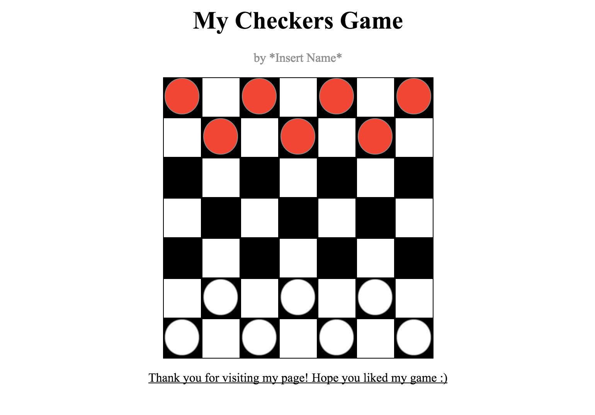

# CSS Selector Challenges

## The Goal
In this lab, we're going to be taking a deep dive into CSS selectors. When styling your html it's important to be able to easily identify and select the exact elements that you want to style.

## The Lab
If you open up your index.html file you'll see a full page of html ready to be styled. This file has been linked to the style.css file that you also have access to. You may notice that when you preview the html file, nothing on the page seems to actually be styled. This is because despite the fact that the styling rules have been written for you (in style.css), the selectors used to identify which elements the rules will apply to have not been.

Your job is to work through the specifications for each of the selectors (detailed below), to achieve the final result:

The details for each selector are written below, replace each "selector_i" with the correct selector to see styling begin to occur on the page.

<!-- TODO: add screen shots of how the page should look after each one is individually correct -->

**selector_1**: should select all h1 elements on the page

**selector_2**: should select the element with an id of "board"

**selector_3**: should select all elements with a class of "cell"

**selector_4**: should select all elements with a class of "team1"

**selector_5**: should select all elements with a class of "team2"

**selector_6**: should select every paragraph directly after an h1

**selector_7**: should select every paragraph element that is directly preceded by a div. (Do this in a different way from the selector you used for selector_6)

**selector_8**: should select any elements with a class of team1 when the mouse is hovering over it

**selector_9**: should select any elements with a class of team2 when the mouse is hovering over it

**selector_10**: should select every div inside of another div inside of another div (this will be the way that the actual pieces on the board are styled)

**selector_11**: should select every odd numbered cell (with cell 1 being the first element with a class of cell and so on)
